# 💰 FinTrack — Personal Finance Management System

<div align="center">

**A full-stack personal finance management application built with Java Spring Boot and Vanilla JavaScript.**

[](https://fintrack-vmcu.onrender.com)
[](https://fintrack-vmcu.onrender.com/swagger-ui/index.html)
[](https://neon.tech)

</div>

---

## 📖 Table of Contents

- [Overview](#-overview)
- [Features](#-features)
- [Tech Stack](#-tech-stack)
- [System Architecture](#-system-architecture)
- [Database Design](#-database-design)
- [API Endpoints](#-api-endpoints)
- [Authentication Flow](#-authentication-flow)
- [Data Flow](#-data-flow)
- [Project Structure](#-project-structure)
- [Local Development Setup](#-local-development-setup)
- [Deployment Strategy](#-deployment-strategy)
- [CI/CD Pipeline](#-cicd-pipeline)
- [Deployment Challenges & Solutions](#-deployment-challenges--solutions)
- [Future Enhancements](#-future-enhancements)

---

## 🌟 Overview

FinTrack is a comprehensive personal finance management system that empowers users to take control of their money. Users can securely register, track income and expenses, set monthly budgets, define spending categories, and view detailed dashboards and reports — all from a clean, responsive web interface.

The application follows a **client-server architecture** with a RESTful API backend and a lightweight vanilla JavaScript frontend, making it easy to understand, extend, and deploy.

---

## ✨ Features

| Feature | Description |
|---------|-------------|
| 🔐 **JWT Authentication** | Secure registration and login with stateless token-based auth |
| 💵 **Income Tracking** | Log income sources with amounts, descriptions, and dates |
| 💸 **Expense Management** | Categorize and track daily expenses |
| 🏷️ **Custom Categories** | Create personalized spending categories |
| 📊 **Monthly Budgets** | Set spending limits and monitor usage in real-time |
| 📈 **Dashboard** | High-level overview of balances, recent transactions, and budget health |
| 📋 **Reports** | Category-wise monthly spending summaries and breakdowns |
| 📄 **API Documentation** | Interactive Swagger UI for all endpoints |
| 🏥 **Health Check** | Public `/` endpoint returning API status as JSON |

---

## 🛠️ Tech Stack

### Backend
| Technology | Purpose |
|-----------|---------|
| **Java 17** | Core programming language |
| **Spring Boot 3.3.x** | Application framework |
| **Spring Security** | Authentication & authorization |
| **Spring Data JPA** | Database ORM layer |
| **JWT (JSON Web Tokens)** | Stateless authentication tokens |
| **Hibernate** | JPA implementation & DDL auto-generation |
| **PostgreSQL** | Production database (Neon) |
| **H2** | In-memory database for local development |
| **Lombok** | Reduces boilerplate code |
| **SpringDoc OpenAPI** | Auto-generated Swagger documentation |
| **Maven** | Build and dependency management |

### Frontend
| Technology | Purpose |
|-----------|---------|
| **HTML5** | Page structure and semantics |
| **CSS3** | Styling with responsive design |
| **Vanilla JavaScript (ES6+)** | Application logic, DOM manipulation |
| **Fetch API** | HTTP requests to backend REST API |

### Infrastructure
| Technology | Purpose |
|-----------|---------|
| **Render** | Cloud hosting (Backend Web Service + Frontend Static Site) |
| **Neon** | Managed PostgreSQL database (free tier) |
| **Docker** | Containerized backend deployment |
| **GitHub** | Source control + CI/CD trigger via webhooks |

---

## 🏗️ System Architecture

### Architecture at a Glance

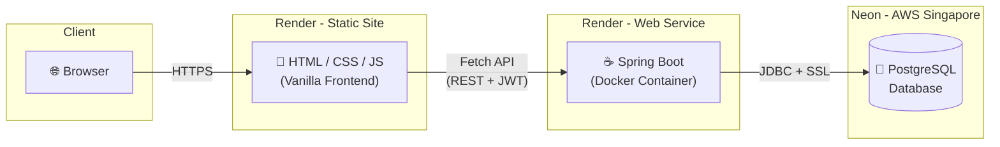

### Component Map

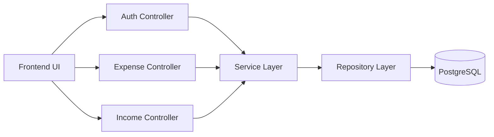

The application is structured into discrete components, keeping separation of concerns intact:
- **Frontend**: Contains static HTML pages like `dashboard.html` and `expense.html`, driven by `app.js`.
- **Controllers**: Handle incoming HTTP requests and validate input data.
- **Services**: Contain the core business logic, such as ensuring users can only access their own data.
- **Repositories**: Interface with the database using Spring Data JPA.

### Layered Architecture

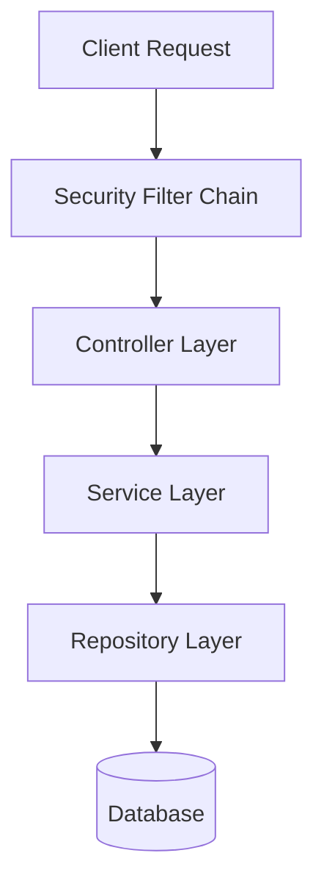

The backend follows a standard layered architecture:
1. **Security Layer**: Every incoming request passes through the `JwtAuthenticationFilter`, which verifies the token signature and extracts the user identity.
2. **Controller Layer**: Responsible for mapping HTTP endpoints (e.g., `@PostMapping("/api/v1/expenses")`) and standardizing JSON responses.
3. **Service Layer**: Handles data transformation (DTOs to Entities) and enforces business rules.
4. **Repository Layer**: Generates SQL queries dynamically via Hibernate to interact with the underlying database.

---

## 🗃️ Database Design

### Entity Relationship Diagram

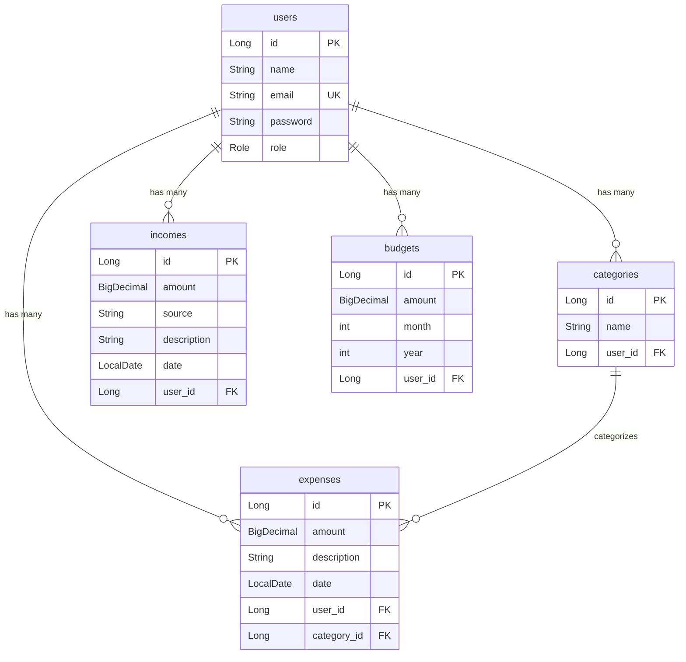

### Key Design Decisions

- **`ddl-auto: update`** — Hibernate automatically creates and updates tables from `@Entity` classes. No manual SQL migration scripts needed.
- **`@GeneratedValue(IDENTITY)`** — Auto-incrementing primary keys managed by PostgreSQL.
- **`Role` as ENUM** — Stored as `STRING` in the database for readability (`USER`, `ADMIN`).
- **User-scoped data** — Every entity (expense, income, budget, category) belongs to a specific user via a `user_id` foreign key, ensuring data isolation.

---

## 🔌 API Endpoints

### Authentication (Public)
| Method | Endpoint | Description |
|--------|----------|-------------|
| `POST` | `/api/v1/auth/register` | Register a new user |
| `POST` | `/api/v1/auth/login` | Login and receive JWT token |

### Expenses (Protected — JWT Required)
| Method | Endpoint | Description |
|--------|----------|-------------|
| `GET` | `/api/v1/expenses` | Get all expenses for logged-in user |
| `POST` | `/api/v1/expenses` | Add a new expense |
| `PUT` | `/api/v1/expenses/{id}` | Update an existing expense |
| `DELETE` | `/api/v1/expenses/{id}` | Delete an expense |

### Income (Protected)
| Method | Endpoint | Description |
|--------|----------|-------------|
| `GET` | `/api/v1/incomes` | Get all incomes |
| `POST` | `/api/v1/incomes` | Add a new income |
| `PUT` | `/api/v1/incomes/{id}` | Update an income |
| `DELETE` | `/api/v1/incomes/{id}` | Delete an income |

### Categories (Protected)
| Method | Endpoint | Description |
|--------|----------|-------------|
| `GET` | `/api/v1/categories` | Get all categories |
| `POST` | `/api/v1/categories` | Create a new category |
| `DELETE` | `/api/v1/categories/{id}` | Delete a category |

### Budgets (Protected)
| Method | Endpoint | Description |
|--------|----------|-------------|
| `GET` | `/api/v1/budgets` | Get budget for current month |
| `POST` | `/api/v1/budgets` | Set a monthly budget |

### Dashboard & Reports (Protected)
| Method | Endpoint | Description |
|--------|----------|-------------|
| `GET` | `/api/v1/dashboard` | Get financial overview (balance, recent transactions) |
| `GET` | `/api/v1/reports/monthly` | Get category-wise spending report |

### Health (Public)
| Method | Endpoint | Description |
|--------|----------|-------------|
| `GET` | `/` | API health check (returns status JSON) |

> 📝 All protected endpoints require a `Authorization: Bearer <jwt_token>` header.

---

## 🔐 Authentication Flow

### Registration & Login

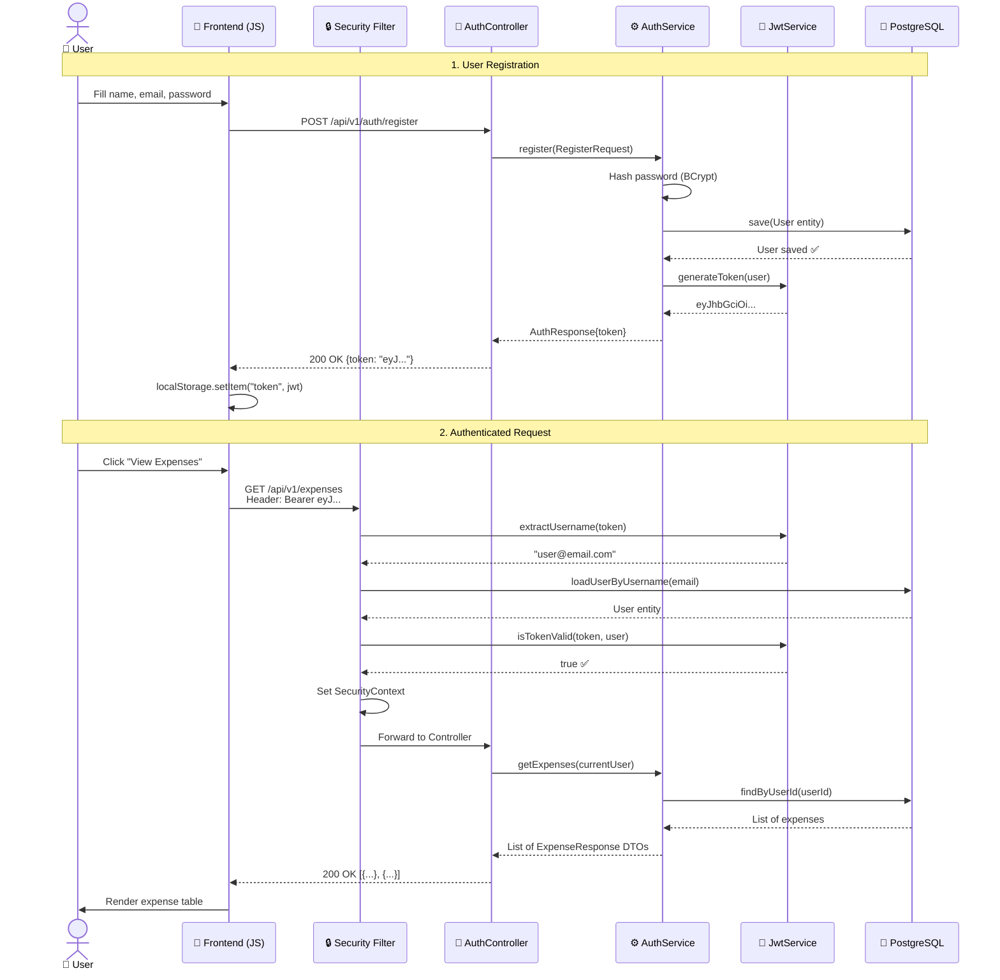

### Security Implementation Details

- **Password Storage**: BCrypt hashing with salt (never stored in plain text)
- **Token Signing**: HMAC-SHA256 with a 256-bit secret key
- **Token Expiration**: 24 hours (86400000 ms)
- **Stateless Sessions**: No server-side session storage; each request is authenticated independently via the JWT
- **Filter Chain**: `JwtAuthenticationFilter` runs before every request as a `OncePerRequestFilter`

---

## 🔄 Data Flow

### Adding a New Expense (End-to-End)

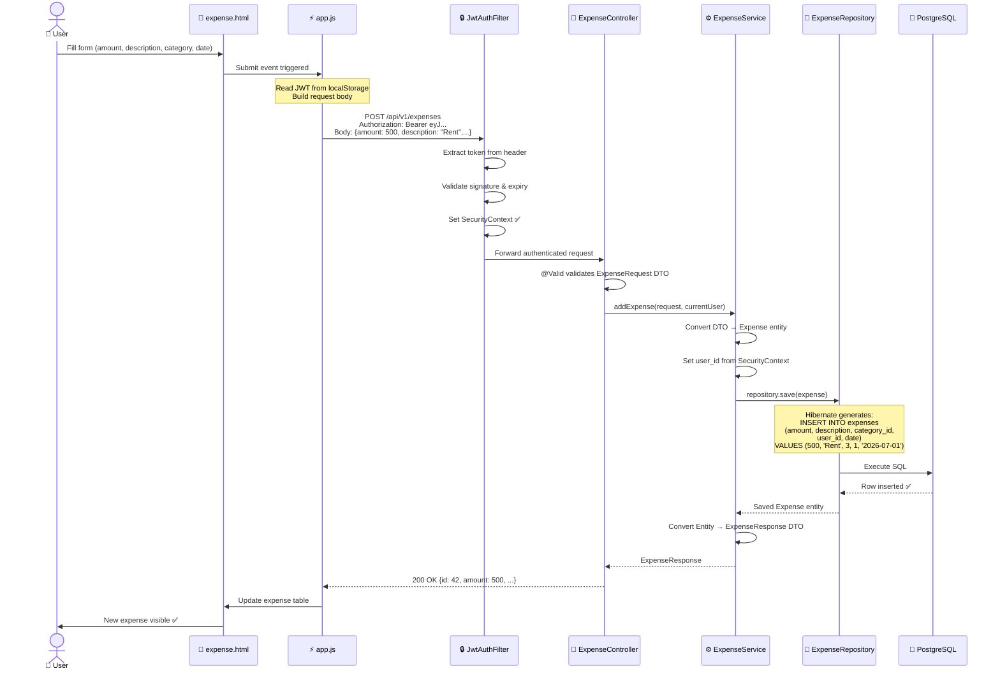

### Dashboard Data Flow

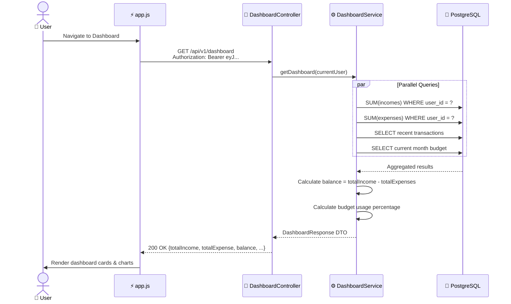

---

## 📁 Project Structure

```
FinTrack/
│
├── backend/                                    # Spring Boot REST API
│   ├── Dockerfile                              # Multi-stage Docker build
│   ├── pom.xml                                 # Maven dependencies
│   ├── mvnw                                    # Maven wrapper (no install needed)
│   └── src/main/java/com/fintrack/
│       ├── FinTrackApplication.java            # Main entry point (@SpringBootApplication)
│       ├── config/
│       │   └── SecurityConfig.java             # Spring Security + CORS + JWT filter chain
│       ├── controller/
│       │   ├── AuthController.java             # POST /register, /login
│       │   ├── ExpenseController.java          # CRUD /expenses
│       │   ├── IncomeController.java           # CRUD /incomes
│       │   ├── CategoryController.java         # CRUD /categories
│       │   ├── BudgetController.java           # GET/POST /budgets
│       │   ├── DashboardController.java        # GET /dashboard
│       │   ├── ReportController.java           # GET /reports
│       │   └── HealthController.java           # GET / (public health check)
│       ├── dto/                                # Data Transfer Objects
│       │   ├── AuthRequest.java                # Login request body
│       │   ├── RegisterRequest.java            # Registration request body
│       │   ├── AuthResponse.java               # JWT token response
│       │   ├── ExpenseRequest/Response.java    # Expense I/O
│       │   ├── IncomeRequest/Response.java     # Income I/O
│       │   ├── BudgetRequest/Response.java     # Budget I/O
│       │   ├── CategoryRequest/Response.java   # Category I/O
│       │   ├── DashboardResponse.java          # Dashboard summary
│       │   ├── CategorySpendingDto.java        # Report data
│       │   ├── TransactionDto.java             # Recent transactions
│       │   └── ErrorResponse.java              # Standardized error format
│       ├── entity/                             # JPA Entities (= Database Tables)
│       │   ├── User.java                       # users table (implements UserDetails)
│       │   ├── Expense.java                    # expenses table
│       │   ├── Income.java                     # incomes table
│       │   ├── Category.java                   # categories table
│       │   ├── Budget.java                     # budgets table
│       │   └── Role.java                       # ENUM: USER, ADMIN
│       ├── repository/                         # Spring Data JPA Repositories
│       │   ├── UserRepository.java
│       │   ├── ExpenseRepository.java
│       │   ├── IncomeRepository.java
│       │   ├── CategoryRepository.java
│       │   └── BudgetRepository.java
│       ├── security/                           # JWT Security Implementation
│       │   ├── JwtService.java                 # Token generation & validation
│       │   ├── JwtAuthenticationFilter.java    # OncePerRequestFilter
│       │   └── CustomUserDetailsService.java   # Loads user by email
│       ├── service/                            # Business Logic Layer
│       │   ├── AuthService.java
│       │   ├── ExpenseService.java
│       │   ├── IncomeService.java
│       │   ├── CategoryService.java
│       │   ├── BudgetService.java
│       │   ├── DashboardService.java
│       │   └── ReportService.java
│       ├── exception/                          # Custom Exception Handling
│       └── util/                               # Utility classes
│
├── frontend/                                   # Vanilla HTML/CSS/JS Frontend
│   ├── index.html                              # Login & Registration page
│   ├── dashboard.html                          # Financial overview
│   ├── expense.html                            # Expense management
│   ├── income.html                             # Income management
│   ├── budget.html                             # Budget management
│   ├── category.html                           # Category management
│   ├── reports.html                            # Monthly reports
│   ├── css/
│   │   └── style.css                           # Global styles
│   └── js/
│       └── app.js                              # Core JS (API calls, auth, DOM logic)
│
├── postman/                                    # API Testing
│   └── FinTrack.postman_collection.json        # Import into Postman
│
├── docker-compose.yml                          # Local PostgreSQL setup
├── .gitignore                                  # Git ignore rules
└── README.md                                   # This file
```

---

## 💻 Local Development Setup

### Prerequisites
- Java 17+ (JDK)
- Git

### 1. Clone the Repository
```bash
git clone https://github.com/rosh223/FinTrack.git
cd FinTrack
```

### 2. Start the Backend
The backend is configured to use an **in-memory H2 database** by default for local development, so you don't need PostgreSQL or Docker installed.

```bash
cd backend
./mvnw spring-boot:run
```

The API will be available at:
- **API Base**: `http://localhost:8080/api/v1`
- **Swagger Docs**: `http://localhost:8080/swagger-ui.html`
- **H2 Console**: `http://localhost:8080/h2-console`

### 3. Start the Frontend
```bash
cd frontend
python3 -m http.server 8000
```
Open `http://localhost:8000` in your browser.

### 4. API Testing with Postman
Import `postman/FinTrack.postman_collection.json` into Postman to test all endpoints with pre-configured requests.

---

## 🚀 Deployment Strategy

### Three-Tier Cloud Architecture

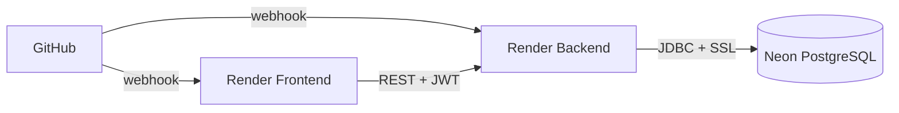

The application is deployed using a classic **three-tier architecture** where each concern is isolated on its own managed service:

- **Frontend (Render Static Site)** — Serves the vanilla HTML/CSS/JS files through a global CDN. No build step is required since there is no framework. Deployments are instant (~10 seconds).
- **Backend (Render Web Service)** — Runs the Spring Boot application inside a Docker container. Render builds the image using a multi-stage Dockerfile, starts the container, performs a health check on port 8080, and then routes traffic to the new version using a zero-downtime swap.
- **Database (Neon PostgreSQL)** — A serverless managed PostgreSQL instance on AWS Singapore. Neon's free tier provides 0.5GB of storage and automatically suspends the database when idle to save resources. The backend connects over JDBC with SSL encryption.

### Deployment Configuration

| Component | Platform | Type | Root Directory |
|-----------|----------|------|---------------|
| **Backend** | Render | Web Service (Docker) | `backend` |
| **Frontend** | Render | Static Site | `frontend` |
| **Database** | Neon | Managed PostgreSQL | — |

### Environment Variables (Backend on Render)

| Variable | Description |
|----------|-------------|
| `DATABASE_URL` | JDBC connection string to Neon PostgreSQL |
| `DATABASE_USERNAME` | Database username |
| `DATABASE_PASSWORD` | Database password (secret) |
| `DATABASE_DRIVER` | `org.postgresql.Driver` |
| `DATABASE_DIALECT` | `org.hibernate.dialect.PostgreSQLDialect` |

### Dockerfile (Multi-Stage Build)

```dockerfile
# Stage 1: Build the JAR using Maven
FROM eclipse-temurin:17-jdk-jammy AS build
WORKDIR /app
COPY .mvn/ .mvn
COPY mvnw pom.xml ./
RUN ./mvnw dependency:go-offline
COPY src ./src
RUN ./mvnw clean package -DskipTests

# Stage 2: Run with lightweight JRE
FROM eclipse-temurin:17-jre-jammy
WORKDIR /app
COPY --from=build /app/target/*.jar app.jar
EXPOSE 8080
ENTRYPOINT ["java", "-Xmx256m", "-jar", "app.jar"]
```

**Why multi-stage?**
- Stage 1 uses the full JDK (500MB+) to compile the code
- Stage 2 uses only the JRE (200MB) to run it
- Final image is ~60% smaller, faster to deploy

**Why `-Xmx256m`?**
- Render's free tier has a 512MB RAM limit
- Without this flag, Java greedily allocates all available memory and gets killed by the OS (OOM kill)
- 256MB is plenty for a Spring Boot app with low traffic

---

## 🔁 CI/CD Pipeline

### How It Works (No Setup Required!)

Render provides **built-in CI/CD** through GitHub webhooks. There is no need to configure GitHub Actions, Jenkins, or any external CI tool.

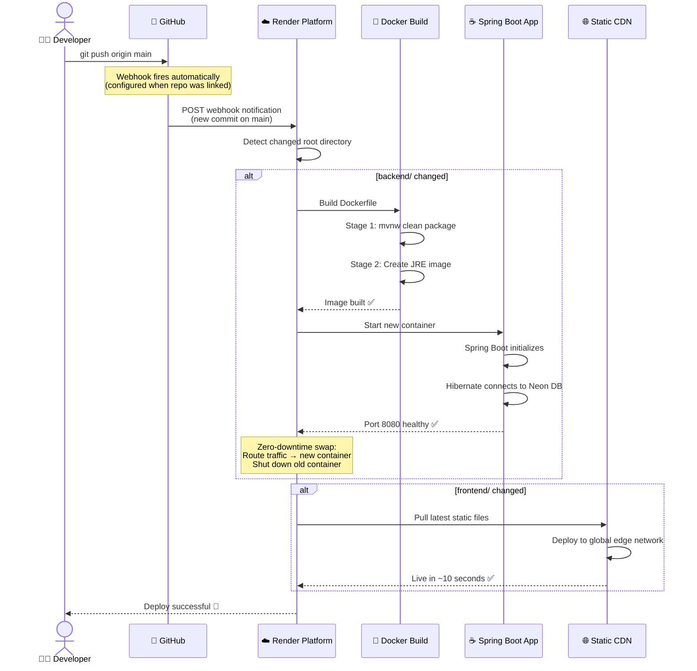

### What Happens Under the Hood

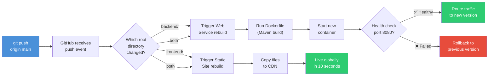

> ⚡ **Total deployment time**: ~3-5 minutes for backend, ~10 seconds for frontend

---

## 🐛 Deployment Challenges & Solutions

### Challenge 1: Java Out of Memory (OOM) on Render

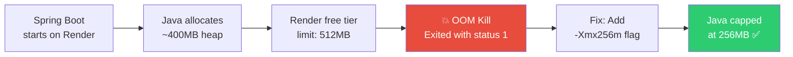

**Problem**: Spring Boot crashed immediately on startup with `Exited with status 1` and `No open ports detected`.

**Root Cause**: Java's default behavior is to allocate as much heap memory as the OS allows. On Render's free tier (512MB RAM), Java tried to grab ~400MB for the heap, leaving no room for the OS, JVM internals, or Hibernate.

**Solution**: Added `-Xmx256m` flag to the Dockerfile's `ENTRYPOINT`.

---

### Challenge 2: Supabase IPv6 vs Render IPv4

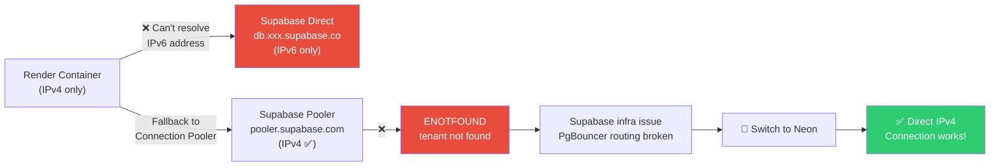

**Problem 1**: `java.net.UnknownHostException: db.xxxx.supabase.co` — Render couldn't resolve the database host.

**Root Cause**: Supabase migrated direct connections to **IPv6-only**. Render's free tier runs on **IPv4-only** networks.

**Problem 2**: Switched to Supabase's pooler, but got `FATAL: (ENOTFOUND) tenant/user not found`.

**Root Cause**: Supabase's PgBouncer routing table hadn't propagated the newly created project's tenant. Their dashboard confirmed: *"We are investigating a technical issue."*

**Solution**: Migrated from Supabase to **Neon** — which provides direct IPv4 PostgreSQL connections with zero pooler overhead. Connected successfully on the first attempt.

---

### Challenge 3: 403 Forbidden on Root URL

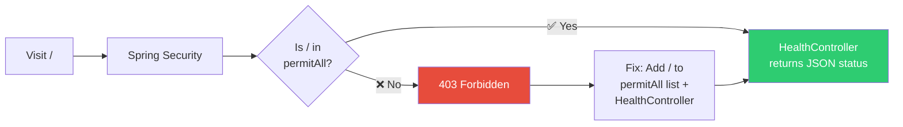

**Problem**: Visiting the backend root URL returned `HTTP ERROR 403`.

**Root Cause**: Spring Security blocks all unauthenticated requests by default, and there was no controller mapped to `/`.

**Solution**: Created `HealthController.java` with a public `@GetMapping("/")` and added `"/"` to the `permitAll()` list in `SecurityConfig.java`.

---

### Summary of All Issues

| # | Issue | Root Cause | Resolution |
|---|-------|-----------|------------|
| 1 | OOM crash on Render | Java default heap > Render's 512MB limit | `-Xmx256m` in Dockerfile |
| 2 | Can't resolve Supabase host | Supabase uses IPv6, Render uses IPv4 | Switched to Connection Pooler |
| 3 | Pooler tenant not found | Supabase PgBouncer infrastructure issue | Migrated to Neon PostgreSQL |
| 4 | 403 on root URL | Spring Security blocks unauthenticated `/` | Added HealthController + permitAll |

---

## 🔮 Future Enhancements

- [ ] **Email Verification** — Verify user email during registration
- [ ] **Password Reset** — Forgot password flow with email OTP
- [ ] **Export to CSV/PDF** — Download expense reports
- [ ] **Recurring Expenses** — Auto-log monthly recurring bills
- [ ] **Multi-Currency Support** — Track expenses in different currencies
- [ ] **Charts & Graphs** — Visual spending trends using Chart.js
- [ ] **Dark Mode** — Theme toggle for the frontend
- [ ] **Mobile Responsive** — Fully responsive design for mobile devices
- [ ] **Admin Panel** — Admin dashboard to manage all users
- [ ] **Rate Limiting** — Prevent API abuse with request throttling
- [ ] **Unit & Integration Tests** — Comprehensive test coverage with JUnit + Mockito
- [ ] **GitHub Actions CI** — Run tests automatically before deployment

---

## 📝 License

This project is open source and available under the [MIT License](LICENSE).

---

<div align="center">

**Built with ❤️ by [Roshan Singh](https://github.com/rosh223)**

*If you found this project helpful, consider giving it a ⭐ on GitHub!*

</div>
